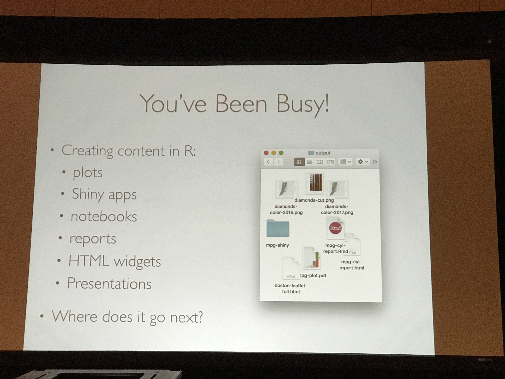

## Overview

I attended RStudio's conference this year in Orlando, Florida.  The conference had 400 attendees representing an incredibly diverse group of companies and industries.  Professionals from financial services had a strong showing. I met BI analysts, portfolio managers, risk analysts, and others from a range of firms involved in asset management, banking, and insurance. I met data scientist and analysts from companies involved in life sciences, advertising, ancestry research, and consulting.  All of this is to say that the utility of R as an analysis and reporting platform is clearly a compelling value proposition to an extremely wide range of individuals and firms. 

## What's RStudio up to?

RStudio may be best known for their leading IDE but their vision for the modern data science environment goes beyond one tool. RStudio has a solution with well-defined vision and execution for three key phases of enterprise data analysis. transparent, auditable, reproducible analysis, Shiny and RMarkdown provides the tools to create a wide range of data-drive content, and RStudio provides the publishing platform needed for an enterprise to deploy 

Classify their efforts into three main verticals; bringing software development best pactices to data analysis, utilizing the power and flexibility of web technology, and creating a common interface across data analysis methodologies, sources, approahces.

## RStudio IDE

RStudio is a platform for transparent, auditable, reproducible data analysis based in the R computing environment. RStudio's eponymous product comes in 2 flavors, desktop and hosted, with an open-source and commercial option for each. Kevin Ushey, lead engineer on the IDE, gave a talk "What's New in the IDE" ([slides here](https://rawgit.com/kevinushey/2017-rstudio-conf/master/slides.html#1)) which showcased a range of features to maximize R programmers productivity. From intelligent autocompletion to project-wide file and function search, it is clear to me that RStudio has a deep understanding of what it is really like to be an R programmer.

In another session, RStudio engineer Jon Mcpherson spoke about "RStudio Server Pro Power Tools" ([slides here](https://github.com/jmcphers/rsp-power-tools/blob/master/rsp-power-tools.Rmd)). RStudio Server provides a wide range of features to support enterprise concerns including scalability, auditing and monitoring, logging, load-balancing, pair programming, enhanced security, and remote access. 

## R Packages

RStudio is working on a wide range of R packages that support and enhance the ecosystem.  They have packages for a wide range of database connections and are working on adding connections to the GUI. [Click here](https://rawgit.com/jimhester/presentations/master/2017_01_13-RStudio_conf-Database_Best_Practices/2017_01_13-RStudio_conf-Database_Best_Practices.html#/) for the slides from the talk "Database Best Practices."

The tidyverse is a set of R packages created by Hadley Wickham focused on creating an easy and human-readable grammar for data analysis. Many of the packages in the tidyverse are among the most popular R packages available. Hadley Wickham's keynote on the first day of the conference was about the core principles of the tidyverse 

## Shiny Apps

## RMarkdown Reports & Beyond

## RStudio Connect

Now we have a wide range of data products that can analyze, administer, blah everything. What do we do with them now?  RStudio connect is a centralized platform for the hosting and distribution of products created in RStudio. This includes Shiny Apps, markdown reports, markdown slide decks, markdown anything.

## Happy Git & Github for useRs
